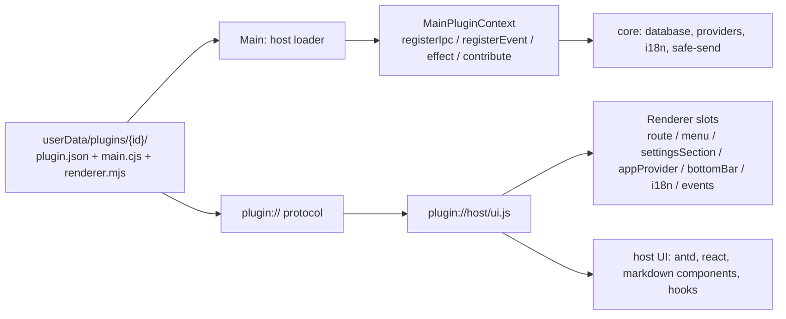
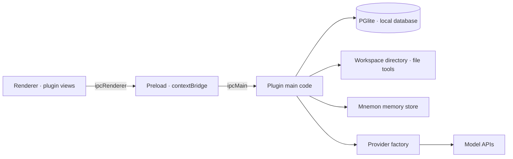

<p align="center">
  
</p>

<h1 align="center">RytenBench</h1>

<p align="center">An AI-powered personal desktop workspace — documents, knowledge bases, todos, knowledge graphs and an agent workbench, in one Electron app.</p>

<p align="center">
  
  
  
  
  
  
</p>

---

## Overview

RytenBench is a cross-platform Electron desktop application that puts two things side by side:

- a **notes workspace** — Markdown documents, knowledge bases with a directory tree, todos, and an
  LLM-built knowledge graph;
- an **AI assistant workbench** — multiple workspaces, per-workspace conversations driven by a
  LangGraph runtime with streaming, tool calling, sub-agents, background jobs and a three-layer
  memory system.

Everything beyond the application shell is a **plugin**. The core process only owns the window /
tray / theme / i18n shell, the plugin host, the PGlite database engine, the model provider factory
and the generic preload bridge. Notes and the assistant are plugins themselves, and they are loaded
from exactly the same on-disk package format as a third-party plugin — so a built-in feature can be
disabled or uninstalled just like any other.

---

## Features

### Notes — built-in `notes` plugin

- **Dashboard** — a landing view with a time-aware greeting, recent documents, open todos and
  overdue counts, plus quick entry points into the document tree.
- **Document tree** — hierarchical documents and directories with in-tree search across documents,
  todos and knowledge bases; create, import, delete and archive documents.
- **WYSIWYG Markdown editor** — built on TipTap v3 with bidirectional Markdown conversion:
  a slash (`/`) block menu, tables, task lists, code blocks with syntax highlighting, KaTeX math
  and Mermaid diagrams with pan/zoom controls. MDX constructs (`import` / `export` / JSX) survive
  both editing and preview untouched. Pasted and dropped images are compressed on the fly
  (screenshots stay PNG, other formats become JPEG q0.85, GIF is passed through). Debounced
  auto-save plus `Ctrl+S`, a save-state indicator, a breadcrumb bar and an outline panel that
  scrolls in sync with the document.
- **Documents** — title, summary, tags and per-document properties; import from `txt` / `md` /
  `docx` / `html` (DOCX via mammoth, HTML article extraction via Readability, both converted to
  Markdown), export back to Markdown.
- **Knowledge bases** — wikis with a nested directory tree, summaries, tags and cover images.
  Documents are linked into directories through a many-to-many model, so one document can live in
  several knowledge bases; an archive dialog moves a document straight into a chosen directory.
- **Todos** — priority, status, category and Markdown body, with a dependency graph between tasks.
  The notes view has a dedicated todo pane next to the outline panel.
- **Knowledge graph** — extracted from the documents of a knowledge base by the configured model:
  heading-aware chunking, entity and relation extraction with cached LLM calls, cross-chunk entity
  merging, an optional gleaning second pass, and incremental appends when new documents are added.
  Rendered on an ECharts canvas with an entity detail panel and persisted node positions; build
  progress streams into a floating progress overlay. Build parameters (concurrency, chunk size,
  gleaning threshold) and the graph / embedding models are configured in Settings → Graph.

### AI assistant — built-in `harness` plugin

- **Workspaces** — each workspace is bound to a real directory on disk. Conversations (topics),
  messages, sub-agent configuration and memory are isolated per workspace; switching workspaces
  never leaks history or memory between them.
- **Streaming conversation** — token streaming with a typewriter renderer, reasoning (thinking)
  display, tool-call cards with an on-demand detail viewer, and a per-turn usage panel (provider /
  model, cached vs. uncached input, cache reads and writes, output, reasoning share, call count).
- **Input & attachments** — file reference chips, drag-and-drop or pasted images (with a vision
  capability check against the selected model) and a message queue: sending while a turn is
  running parks the message in a dock where it can be edited, removed or injected into the running
  turn immediately.
- **Goals** — a long-running objective can be persisted on the topic; the goal bar shows phase
  (active / paused / blocked / complete) and round progress, and automatic continuations are
  rendered as their own rounds in the transcript.
- **Sub-agents & background agents** — named agents with their own system prompt, tool selection
  and memory directory; the main agent can delegate through a task tool, and background agents run
  in parallel with a status button summarising running / completed / failed / stopped runs.
- **Workflow orchestration** — a workflow tool lets the model write a JavaScript orchestration
  script (top-level `await`, `agent` / `pipeline` / `parallel` / `phase` / `log` / `args` hooks)
  that fans work out across many one-shot sub-agents, executed in a `node:vm` sandbox with no
  filesystem, network or timers, and with concurrency and total-agent caps.
- **Context compaction** — history is kept inside the model window by two mechanisms: a
  zero-cost tool-result pruner applied when history is replayed, and LLM summarisation that folds
  the oldest exchanges into a structured checkpoint persisted per topic and reused until the
  compaction boundary advances again.
- **Memory (Mnemon)** — a three-layer memory system in every workspace: runtime memory (a user
  profile plus a project memory file, injected every turn), project documents (Markdown archives
  with hot/cold tiering) and long-term memory spaces (graph relations with deep recall, backed by
  PGlite). It is exposed to the model as 13 `mnemon_*` tools and is configurable in
  Settings → Memory.
- **Skills** — a local directory of skills, where every sub-directory containing a `SKILL.md`
  (YAML frontmatter with `name` / `description`) is a skill; enabled skills are injected into the
  system prompt. Managed in Settings → Skills.
- **Workspace files** — file explorer and CodeMirror 6 editor (with a Markdown rich/source toggle,
  language modes, search, folding, word wrap and caret/selection status) inside the assistant view,
  live-reacting to on-disk changes and warning when a file changed on disk while unsaved edits
  exist.
- **Change review** — every write the agent performs is recorded: before-image snapshots on disk
  plus per-file change history. The diff view supports per-hunk Keep / Revert, Keep all and
  Revert all, and older revisions can be inspected without losing the pending review.
- **Failure recovery** — when a model request fails, a recovery dialog lets you switch to another
  configured model and resume from the interruption point: the prompt is not resent and completed
  tool calls are not re-run.

### Model providers

- Multiple providers and models with **AES-256-GCM encrypted API keys**, encrypted with a
  machine-specific key — credentials are bound to the machine that created them.
- Protocol-based configuration: pick a known platform or type any protocol identifier, and any
  unknown protocol is called in an OpenAI-compatible way. Custom endpoints can be OpenAI- or
  Anthropic-compatible.
- **Model profile autofill** — model IDs are matched against a bundled `models-profile.json`
  while typing, filling in the official display name, context window, max output and capability
  flags; anything unlisted can be filled in by hand.
- Fetch a model list from any OpenAI-compatible endpoint (`GET /v1/models`) and add models in
  batches, set a default chat model (and a separate default embedding model), pin favourites,
  and tune sampling parameters (temperature / top-p / top-k), thinking mode, image input support,
  context window, max output and per-conversation tool-call rounds.

### Application shell

- **Custom frameless window** — title bar, sidebar navigation, bottom bar and right bar; all
  navigation entries come from the plugin registry.
- **Bottom bar carousel** — the built-in weather entry plus whatever plugins register through the
  `bottomBar` slot (for example the music player's now-playing tab and hover popup).
- **Weather** — local conditions and a three-day forecast from Open-Meteo, located through IP
  geolocation, cached in electron-store and refreshed on a configurable interval.
- **Settings** — General (interface language, theme, tray behaviour, lock screen), Models, Graph,
  System info, Plugins, and an Assistant group (Agents, Skills, Memory). Plugins contribute their
  own settings pages.
- **Localization** — Simplified Chinese and English, switchable at runtime without restart, and
  the main process renders tool output and progress text in the current language too.
- **Theme** — light / dark / auto, where auto follows the time of day (light from 6:00 to 18:00).
- **Lock screen** — an optional 6-digit passcode lock with a change-passcode flow.
- **System tray** — closing the window can keep the app resident in the tray (restore or quit from
  the tray menu); single-instance behaviour focuses the existing window instead of starting a
  second copy.
- **Startup & failure handling** — a dedicated loading window while the database initialises, a
  renderer error boundary that offers a reload, locally collected crash dumps, and a database
  recovery path that can back up and restart from an empty database if PGlite fails to open.

---

## Plugin system

### Built-in and third-party plugins

| Plugin         | Kind        | What it provides                                                      |
| -------------- | ----------- | --------------------------------------------------------------------- |
| `notes`        | Built-in    | Documents, knowledge bases, todos, knowledge graph, dashboard         |
| `harness`      | Built-in    | AI assistant workbench: topics, streaming, tools, memory, files       |
| `task-planner` | Third-party | Planner with a Gantt chart and hierarchical task tree                 |
| `music-player` | Third-party | Folder playlists, playback controls, mini player, metadata extraction |
| `plugin.demo`  | Example     | Minimal external plugin: IPC ping/pong plus a self-rendered page      |

Built-in means **shipped with the app and reinstallable at any time** — not "compiled in". Their
source lives in this repository under `src/plugins/`, but at runtime they are loaded from
`userData/plugins/<id>/` through the very same external-plugin path a third-party package uses, so
the app itself contains no import of a plugin implementation. `task-planner` and `music-player` are
not bundled: they are published in the companion repository
[`Aitenry/ryten-plugins`](https://github.com/Aitenry/ryten-plugins) and installed from the plugin
repository. `examples/demo-plugin` in this repository is a minimal template.

### Installing plugins

1. **Bundled plugins** — on first launch each package in `resources/plugins/` is copied to
   `userData/plugins/<id>/` and activated. Uninstalling a bundled plugin removes that directory;
   it can be installed again from the "built-in plugins available to install" section.
2. **Plugin repository** — a GitHub-hosted index (`plugins.json`) lists plugin ids with their
   version, size and `sha256`. The app downloads the matching Release asset, verifies the checksum,
   unpacks it (rejecting path traversal) and validates `plugin.json` before installing or
   upgrading. The repository URL can be overridden with `RB_PLUGINS_REPO`.
3. **Local install** — install from a local `.zip` package or an unpacked plugin folder.

A plugin can be **enabled / disabled** at any time: disabling it unloads its routes, menu entries,
settings pages, providers, IPC channels, event channels, i18n resources and AI tools immediately.
**Uninstalling removes its code**; deleting its data is a separate, opt-in checkbox in the confirm
dialog (each plugin declares what that would remove, and nothing is deleted by default — data is
still there after reinstalling).

### Plugin package layout

Plugins in this repository live in `src/plugins/<id>/`; third-party plugins use the same shape in
their own repository:

```
<id>/
  manifest.ts            id / name / version / description / icon / inject / routes / menu
  main/
    index.ts             export function install(ctx: MainPluginContext)
    ipc/                 this plugin's IPC channels (ctx.registerIpc)
    db/schema.ts         this plugin's Drizzle tables
    db/mapper.ts         row types and queries (through withOrm)
    services/**.ts       business services
  renderer/
    plugin.tsx           export default { manifest, install(ctx) }
    api.ts               thin wrapper over window.api.plugin.invoke/on
    Index.tsx            route page (lazy-loadable)
    components/ hooks/ utils/
  shared/**.ts           main/renderer DTOs
  locales/index.ts       zh-CN / en-US copy, registered with the plugin
```

`pnpm build:plugins` bundles each plugin into a loadable disk package —
`resources/plugins/<id>/{plugin.json,main.cjs,renderer.mjs,chunk-*.mjs}` — which is what ships as
an `extraResources` entry and what the host actually loads. During `pnpm dev` a package that is
missing or older than its source is rebuilt automatically.

### Host contract

Plugin packages never bundle their own copy of the database, React or i18n. At build time imports
pointing into the core or the host UI are rewritten to `@host/**` specifiers, and at runtime the
host injects the single instances it already has:

- **Main process** — `globalThis.__RB_HOST_RESOLVE__` resolves 21 host module entries
  (`@host/main/**`, plus shared model-parameter presets); other bare modules (electron,
  langchain, zod, drizzle, …) resolve to the host's own instances from the application root.
- **Renderer** — an ESM bridge served from `plugin://host/ui.js?m=<key>` exposes 15 host UI
  modules (i18n, hooks, Markdown components, settings UI, routing skeletons, utilities) plus 8
  vendored libraries (react, react-dom, antd, @remixicon/react, @ant-design/icons, dayjs) so
  provider contexts and component instances stay shared.

Main-process context API: `registerIpc`, `registerEvent`, `effect` (LIFO rollback), `contribute`
and `provide`. Renderer slots: `route`, `menu`, `settingsSection`, `appProvider`,
`globalComponent`, `bottomBar`, `api`, `i18n`, `events`, `storage`. Contribution points let
plugins extend each other without importing each other — the assistant pulls AI tools from
`harness.tool` contributions (this is how the notes plugin exposes its document, wiki, todo and
graph tools to the model), and `plugin.purge` lets a plugin clean up its own data on uninstall.

Channel naming is namespaced as `plugin:<id>:<channel>`; the host validates ownership, rejects
duplicates, and pushes the authoritative channel list to the preload whitelist whenever plugins
are loaded or unloaded.

More detail lives in [`src/plugins/README.md`](src/plugins/README.md),
[`src/plugins/PACKAGING.md`](src/plugins/PACKAGING.md) and
[`src/plugins/MIGRATION.md`](src/plugins/MIGRATION.md).

---

## Tech stack

| Layer            | Technology                                                                                                                                                                   |
| ---------------- | ---------------------------------------------------------------------------------------------------------------------------------------------------------------------------- |
| Framework        | [Electron](https://www.electronjs.org/) 44                                                                                                                                   |
| UI               | [React](https://react.dev/) 19 + [TypeScript](https://www.typescriptlang.org/) 5.9                                                                                           |
| Build            | [electron-vite](https://electron-vite.org/) 6 + [Vite](https://vite.dev/) 8                                                                                                  |
| Component system | [Ant Design](https://ant.design/) 6 + [Tailwind CSS](https://tailwindcss.com/) 4                                                                                             |
| Routing          | [React Router](https://reactrouter.com/) 7 (hash routing)                                                                                                                    |
| i18n             | [i18next](https://www.i18next.com/) 26 + react-i18next                                                                                                                       |
| Markdown editor  | [TipTap](https://tiptap.dev/) 3 + [tiptap-markdown](https://github.com/ueberdosis/tiptap-markdown)                                                                           |
| Markdown view    | [react-markdown](https://github.com/remarkjs/react-markdown) + remark-gfm + rehype-katex/highlight                                                                           |
| Diagrams & math  | [Mermaid](https://mermaid.js.org/) 11 + [KaTeX](https://katex.org/) + [highlight.js](https://highlightjs.org/)                                                               |
| Code editor      | [CodeMirror 6](https://codemirror.net/) via [@uiw/react-codemirror](https://github.com/uiwjs/react-codemirror) + [@codemirror/merge](https://codemirror.net/docs/ref/#merge) |
| Agent runtime    | [LangChain](https://www.langchain.com/) 1.5 + [LangGraph](https://langchain-ai.github.io/langgraph/) 1.4                                                                     |
| Database         | [PGlite](https://pglite.dev/) 0.5 (PostgreSQL compiled to WebAssembly) + [Drizzle ORM](https://orm.drizzle.team/) 0.45                                                       |
| Settings store   | [electron-store](https://github.com/sindresorhus/electron-store) 11                                                                                                          |
| Graph rendering  | [ECharts](https://echarts.apache.org/) 6                                                                                                                                     |
| Validation       | [zod](https://zod.dev/) 4                                                                                                                                                    |
| Document import  | [mammoth](https://github.com/mwilliamson/mammoth.js) + [turndown](https://github.com/mixmark-io/turndown) + [Readability](https://github.com/mozilla/readability)            |
| Audio metadata   | [music-metadata](https://github.com/Borewit/music-metadata) (music plugin)                                                                                                   |
| Weather          | [open-meteo](https://open-meteo.com/)                                                                                                                                        |
| Icons            | [Remix Icon](https://remixicon.com/) + Ant Design Icons                                                                                                                      |
| Logging          | [electron-log](https://github.com/megahertz/electron-log)                                                                                                                    |
| Packaging        | [electron-builder](https://www.electron.build/) 26                                                                                                                           |

---

## Model protocols

| Protocol                      | Notes                                           |
| ----------------------------- | ----------------------------------------------- |
| OpenAI                        | Also the fallback for any OpenAI-compatible API |
| Anthropic                     | Claude models                                   |
| DeepSeek                      | Includes reasoning support                      |
| Google Gemini                 | Generative Language API                         |
| Google Vertex AI              | Google Cloud deployments                        |
| Mistral AI                    | Mistral models                                  |
| Ollama                        | Local models                                    |
| OpenRouter                    | Multi-model gateway                             |
| xAI                           | Grok models                                     |
| AWS Bedrock                   | Converse API                                    |
| Cloudflare Workers AI         | Edge-hosted models                              |
| Custom (OpenAI-compatible)    | Any `/v1/chat/completions`-shaped endpoint      |
| Custom (Anthropic-compatible) | Any Anthropic-shaped endpoint                   |

The model form also offers platform presets for common Chinese providers (Zhipu GLM, Alibaba
Cloud Bailian, Baidu Qianfan, Volcano Engine Ark, Tencent Hunyuan, SiliconFlow), which are
configured as OpenAI-compatible endpoints. A separate default embedding model is used for
knowledge base embeddings.

---

## Getting started

### Prerequisites

- [Node.js](https://nodejs.org/) ≥ 20.19 (or ≥ 22.12; Node 22 LTS recommended)
- [pnpm](https://pnpm.io/) ≥ 9 (CI builds with pnpm 10)

`.npmrc` points the Electron and electron-builder binary downloads at the npmmirror mirrors, which
helps on networks where the default hosts are slow. `postinstall` installs the Electron binary and
rebuilds native dependencies.

### Install and run

```bash
git clone https://github.com/Aitenry/RytenBench.git
cd RytenBench
pnpm install
pnpm dev
```

### Scripts

| Command              | What it does                                                                          |
| -------------------- | ------------------------------------------------------------------------------------- |
| `pnpm dev`           | Start the app with hot reload; missing or stale plugin packages are rebuilt on demand |
| `pnpm build:plugins` | Bundle every plugin in `src/plugins/` into `resources/plugins/`                       |
| `pnpm build`         | Type-check and build the main, preload and renderer bundles                           |
| `pnpm typecheck`     | `tsc --noEmit` for the node and web projects                                          |
| `pnpm lint`          | ESLint over the repository (it also walks build output, so it is slow)                |
| `pnpm build:win`     | Plugin packages + app bundles + Windows NSIS installer                                |
| `pnpm build:mac`     | Plugin packages + app bundles + macOS DMG and ZIP (not notarized)                     |
| `pnpm build:linux`   | Plugin packages + app bundles + Linux AppImage and DEB                                |
| `pnpm build:unpack`  | Unpacked directory build, useful for quick smoke tests                                |

A faster local lint that skips `dist/` and `node_modules/`:

```bash
npx eslint --cache src examples electron.vite.config.ts
```

> Plugin packages are generated artifacts: `resources/plugins/` is not committed, and packaging
> scripts run `build:plugins` first. If you only changed core code, `pnpm build` is enough; if you
> changed anything under `src/plugins/**`, the plugin packages must be rebuilt before packaging.

---

## Project structure

```
RytenBench/
├── src/
│   ├── main/                         # Electron main process — shell only
│   │   ├── index.ts                  # Single instance, protocol, windows, tray, host init
│   │   ├── lifecycle.ts  context.ts  safe-send.ts
│   │   ├── weather.ts                # Open-Meteo + IP geolocation, cached and pushed
│   │   ├── address/                  # IP geolocation lookup
│   │   ├── crypto/provider-key.ts    # AES-256-GCM API key encryption (machine-bound)
│   │   ├── database/                 # PGlite + Drizzle engine
│   │   │   ├── loading.ts  instance.ts  orm.ts
│   │   │   ├── schema/               # Core tables (shared images, providers)
│   │   │   ├── mapper/               # Core row types and queries
│   │   │   ├── workspace-context.ts  # Active workspace for tools and IPC
│   │   │   └── workspace-migration.ts
│   │   ├── i18n/                     # Main-process copy (tool results, graph progress)
│   │   ├── ipc/                      # Core IPC: dialog, misc, provider, settings, plugins
│   │   ├── plugins/                  # Plugin host: contexts, loader, installer, protocol
│   │   ├── provider/                 # Multi-protocol chat model factory, cache, model tags
│   │   ├── tray/  windows/           # Tray, loading window, main window, Mermaid preview
│   │   └── shared/  types/
│   ├── preload/                      # contextBridge: core APIs + generic plugin bridge
│   ├── renderer/
│   │   ├── resource/                 # index.html and the loading screen
│   │   └── src/
│   │       ├── components/
│   │       │   ├── markdown/         # TipTap editor, Markdown view, Mermaid, math, MDX
│   │       │   ├── system/           # Frame, settings host, lock screen, skeletons, effects
│   │       │   └── provider/
│   │       ├── contexts/  hooks/     # Theme, language, notifications, messages
│   │       ├── i18n/                 # i18next setup + zh-CN / en-US shell copy
│   │       ├── plugin-host/          # Renderer plugin host: slots, declarations, UI bridge
│   │       ├── providers/  route/  types/  utils/
│   │       └── App.tsx  main.tsx
│   └── plugins/                      # One directory per plugin
│       ├── manifests.ts              # Built-in manifest registry
│       ├── README.md  PACKAGING.md  MIGRATION.md
│       ├── notes/
│       │   ├── manifest.ts  locales/  shared/
│       │   ├── main/                 # index.ts, ipc/, db/{schema,mapper}, graph/, tools/
│       │   └── renderer/             # plugin.tsx, api.ts, components/, providers/, settings/
│       └── harness/
│           ├── manifest.ts  locales/  shared/
│           ├── main/                 # ipc/, db/, service/, runtime/ (agent, tools, mnemon), workspace/
│           └── renderer/             # plugin.tsx, components/, contexts/, hooks/, utils/
├── resources/                        # Icons, tray assets, models-profile.json
│   └── plugins/                      # Generated plugin packages (not committed)
├── scripts/build-plugins.mjs         # Plugin bundler
├── examples/demo-plugin/             # Minimal third-party plugin template
├── drizzle/                          # Generated migrations and snapshots
├── build/                            # electron-builder resources (macOS entitlements)
├── .github/workflows/                # Release builds for Windows, macOS and Linux (on main)
├── drizzle.config.ts  electron-builder.yml  electron.vite.config.ts
└── package.json  tsconfig*.json  LICENSE
```

---

## Architecture

### Processes

- **Main process** (`src/main/`) — application lifecycle, windows, tray, weather, the PGlite /
  Drizzle database engine, the model provider factory, and the plugin host. Core IPC is limited to
  window, settings, dialog and provider management; all plugin channels belong to plugins.
- **Preload** (`src/preload/`) — a context-bridged API surface: core capabilities plus a generic
  plugin bridge (`window.api.plugin.invoke` / `on`) that only allows channels declared by an
  enabled plugin, gated by an authoritative channel list pushed from the main process.
- **Renderer** (`src/renderer/`) — a React 19 single-page app with hash routing. The shell renders
  the frame, route registry, settings host and notification list; everything else arrives through
  plugin registrations.

### Plugin host



Plugin lifecycles are reversible: an install returns a dispose function, effects are rolled back in
LIFO order, and IPC channels, event channels, contributions, i18n resources and UI slots are all
removed on disable, so a disabled plugin stops executing any of its hooks.

### Data flow



### Storage and isolation

- **Database** — a single PGlite cluster in `userData/RytenBenchDB`. The DDL single source of truth
  is the Drizzle schema (`src/main/database/schema/` for core tables plus each plugin's
  `main/db/schema*`); migrations are generated with `npx drizzle-kit generate` into `drizzle/` and
  applied on startup, tracked in `drizzle.__drizzle_migrations`.
- **Workspace-scoped data** — assistant topics, messages, usage records, sub-agent configuration,
  file-change records and memory stores. These live under `<memoryPath>/workspace-<workspaceId>/…`
  (the memory root is a setting), while the tool-result detail store and file-history snapshots are
  kept in `userData` so they never pollute the user's workspace directory.
- **Global data** — documents, knowledge bases (and their graphs), todos and the model provider
  list are shared by every workspace and unaffected by switching or deleting one.
- **Uninstall scope** — a plugin's tables live in the shared database, so removing plugin code and
  removing its data are always two separate decisions.
- **Secrets** — API keys are stored encrypted with AES-256-GCM under a machine-specific key; the
  keystore is never exposed to the renderer.

---

## License

[MIT](./LICENSE) © [Aitenry](https://github.com/Aitenry)
