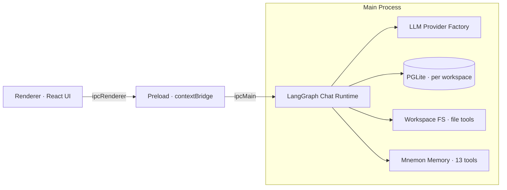

<p align="center">
  
</p>

<h1 align="center">RytenBench</h1>

<p align="center">An AI-powered personal desktop workspace — documents, wikis, knowledge graphs, chat, planner, and music in one Electron app.</p>

<p align="center">
  
  
  
  
  
  
  
</p>

---

## Features

### Home & Documents

- **Home Workspace** — SiYuan-style three-pane layout: a document/knowledge-base tree with full-text search on the left, breadcrumb bar and a WYSIWYG editor in the center, and a Todo pane on the right. Pane widths are draggable, the editor autosaves with debounce (Ctrl+S available), and the outline panel scrolls in sync with the document.
- **WYSIWYG Markdown Editor** — Built on TipTap v3 with bidirectional tiptap-markdown conversion. Slash (`/`) block menu, tables, task lists, code blocks with syntax highlighting, KaTeX math, and Mermaid diagram rendering. Pasted/dropped images are compressed automatically.
- **Documents** — Create, edit, and organize Markdown documents with tags, summaries, cover images, and full-text search. Import from TXT, MD, DOCX, and HTML files (mammoth + turndown + Readability); export to Markdown.
- **Wikis** — Organize documents into wikis with a hierarchical directory tree. Link documents across directories via a many-to-many relationship model. Archive management included.

### AI

- **AI Chat Assistant** — Conversational AI powered by a LangGraph runtime with streaming responses, reasoning (deep thinking) display, tool-call cards, and sub-agent delegation. Chat history is persisted per workspace and topic.
- **Workspaces** — Multiple workspaces, each bound to a real directory on disk. Browse, read, and edit workspace files inline (Monaco-based file editor) with file reference chips in chat input. Chat data, agents, and memory are all isolated per workspace.
- **Built-in Memory (Mnemon)** — A three-layer memory system in every workspace: runtime memory (user profile + project MEMORY, injected every turn), project documents (Markdown archives with cold/hot tiering + LRU), and long-term memory spaces (graph relations + deep recall, backed by PGlite). Exposed to the agent as 13 `mnemon_*` tools.
- **Agent System** — Configure sub-agents per workspace with custom system prompts and tool selections; the main agent supports configurable tools and skills.
- **Skill System** — Load custom skills from a local directory; enable/disable individual skills for chat sessions.
- **Knowledge Graph** — Automatically build knowledge graphs from wiki documents using LLM-powered entity/relation extraction, cross-chunk entity merging, gleaning (second-pass scan), and incremental appends. Visualized with ECharts 6.
- **Multi-Provider LLM Support** — Configure and manage multiple LLM providers with AES-256-GCM encrypted API keys. Supports OpenAI, Anthropic, DeepSeek, Google Gemini, Google Vertex AI, Mistral, Ollama, OpenRouter, xAI, AWS Bedrock, Cloudflare Workers AI, and any OpenAI-compatible endpoint.

### Productivity & Media

- **Planner** — Task management with Gantt chart visualization, hierarchical task tree, task dependencies, priority, and completion status tracking.
- **Weather** — Local weather display with daily forecasts via Open-Meteo API, cached in electron-store for offline access.
- **Music Player** — Full-featured music player with folder-based playlists, playback controls, now-playing display, track liking, recently played history, and a mini player in the sidebar. Importing local audio files with automatic metadata and cover art extraction.

### App Shell

- **Theme Switching** — Light/dark/auto theme with persisted preference. Auto mode follows the time of day (6:00 ~ 18:00).
- **Custom Window Frame** — Frameless window with custom title bar, sidebar navigation, bottom bar, and right bar panels.
- **Lock Screen** — Privacy protection with MD5-hashed password lock, triggered via Escape key.
- **Auto Update** — Built-in application update support via electron-updater.
- **Modern UI** — Clean interface built with Ant Design 6 and Tailwind CSS 4.
- **Cross-Platform** — Runs on Windows, macOS, and Linux (NSIS / DMG / AppImage, snap, deb).

---

## Tech Stack

| Layer              | Technology                                                                                                  |
| ------------------ | ----------------------------------------------------------------------------------------------------------- |
| Framework          | [Electron](https://www.electronjs.org/) 43                                                                  |
| Frontend           | [React](https://react.dev/) 19 + [TypeScript](https://www.typescriptlang.org/) 5.9                          |
| Build Tool         | [electron-vite](https://electron-vite.org/) 6 + [Vite](https://vite.dev/) 8                                 |
| UI Library         | [Ant Design](https://ant.design/) 6 + [Tailwind CSS](https://tailwindcss.com/) 4                            |
| Routing            | [React Router](https://reactrouter.com/) 7                                                                  |
| Markdown Editor    | [TipTap](https://tiptap.dev/) 3 + [tiptap-markdown](https://github.com/ueberdosis/tiptap-markdown)           |
| Markdown View      | [react-markdown](https://github.com/remarkjs/react-markdown) 10 + remark-gfm + rehype-katex/highlight       |
| Diagram & Math     | [Mermaid](https://mermaid.js.org/) + [KaTeX](https://katex.org/) + [highlight.js](https://highlightjs.org/) |
| Code Editor        | [Monaco Editor](https://microsoft.github.io/monaco-editor/)                                                 |
| AI / LLM           | [LangChain](https://www.langchain.com/) + [LangGraph](https://langchain-ai.github.io/langgraph/) (explicit StateGraph runtime) |
| Database           | [PGLite](https://pglite.dev/) (PostgreSQL in WebAssembly) + [electron-store](https://github.com/sindresorhus/electron-store) |
| Visualization      | [ECharts](https://echarts.apache.org/) 6                                                                    |
| Encryption         | AES-256-GCM (API keys) + MD5 (lock screen password)                                                         |
| Icons              | [Remix Icon](https://remixicon.com/)                                                                        |
| Animation          | [animate.css](https://animate.style/) 4                                                                     |
| Document Import    | [mammoth](https://github.com/mwilliamson/mammoth.js) (DOCX) + [turndown](https://github.com/mixmark-io/turndown) (HTML→MD) + [Readability](https://github.com/mozilla/readability) (article extraction) |
| Data Validation    | [zod](https://zod.dev/) + [json-llm-repair](https://github.com/jeanmarcgb/json-llm-repair)                   |
| Audio Metadata     | [music-metadata](https://github.com/Borewit/music-metadata) 11                                              |
| Weather            | [openmeteo](https://github.com/open-meteo/open-meteo)                                                       |
| Logging            | [electron-log](https://github.com/megahertz/electron-log)                                                   |
| Auto Update        | [electron-updater](https://www.electron.build/auto-update)                                                  |
| Packaging          | [electron-builder](https://www.electron.build/)                                                             |

---

## Supported LLM Providers

| Provider             | Class                            | Notes                         |
| -------------------- | -------------------------------- | ----------------------------- |
| OpenAI               | ChatOpenAI                       | Supports custom base URL      |
| Anthropic            | ChatAnthropic                    | Claude models                 |
| DeepSeek             | ChatDeepSeek                     | Includes reasoning support    |
| Google Gemini        | ChatGoogleGenerativeAI           | Generative Language API       |
| Google Vertex AI     | ChatVertexAI                     | Enterprise Google Cloud       |
| Mistral AI           | ChatMistralAI                    | Mistral models                |
| Ollama               | ChatOllama                       | Local LLM runtime             |
| OpenRouter           | ChatOpenRouter                   | Multi-model gateway           |
| xAI                  | ChatXAI                          | Grok models (OpenAI-compatible) |
| AWS Bedrock          | ChatBedrockConverse              | Amazon Bedrock Converse API   |
| Cloudflare Workers AI| ChatCloudflareWorkersAI          | Edge-deployed models          |
| Custom / OpenAI      | ChatOpenAI (fallback)            | Any OpenAI-compatible endpoint |

API keys are encrypted with **AES-256-GCM** using a machine-specific key derived from hostname, username, and user data path — keys are bound to the machine where they were created.

---

## Getting Started

### Prerequisites

- [Node.js](https://nodejs.org/) >= 20.19 (or >= 22.12, LTS recommended)
- [pnpm](https://pnpm.io/) (recommended)

### Installation

```bash
# Clone the repository
git clone https://github.com/Aitenry/RytenBench.git
cd RytenBench

# Install dependencies
pnpm install
```

### Development

```bash
# Start development server with hot reload
pnpm dev
```

### Type Checking & Linting

```bash
pnpm typecheck   # tsc --noEmit for both main and renderer
pnpm lint        # eslint
```

### Build

```bash
# Build for Windows (NSIS installer)
pnpm build:win

# Build for macOS (DMG)
pnpm build:mac

# Build for Linux (AppImage, snap, deb)
pnpm build:linux
```

---

## Project Structure

```
RytenBench/
├── src/
│   ├── main/                        # Electron main process
│   │   ├── address/                 # IP address utilities
│   │   ├── chat/                    # AI chat service (LangChain + LangGraph)
│   │   │   ├── index.ts             # Chat module entry & stream entry points
│   │   │   ├── types.ts             # Chat message, tool call & sub-agent types
│   │   │   ├── service/             # Chat service internals
│   │   │   │   ├── chat.ts          # ChatService: streaming & tool orchestration
│   │   │   │   ├── history.ts       # Chat history loading & management
│   │   │   │   ├── message-builder.ts
│   │   │   │   ├── stream-handler.ts
│   │   │   │   └── stream-producers.ts
│   │   │   ├── tools/               # Domain tool implementations
│   │   │   │   ├── builders.ts      # Tool builder registry
│   │   │   │   ├── docs.ts          # Document tools
│   │   │   │   ├── graph.ts         # Knowledge graph tools
│   │   │   │   ├── music.ts         # Music playback tools
│   │   │   │   ├── planner.ts       # Planner/task tools
│   │   │   │   ├── time.ts          # Time/date tools
│   │   │   │   ├── todos.ts         # Todo management tools
│   │   │   │   ├── weather.ts       # Weather information tools
│   │   │   │   └── wikis.ts         # Wiki management tools
│   │   │   └── runtime/             # LangGraph agent runtime
│   │   │       ├── runtime.ts       # Runtime assembly entry
│   │   │       ├── agent.ts         # Explicit StateGraph agent definition
│   │   │       ├── subagent.ts      # Task tool & sub-agent delegation
│   │   │       ├── graph.ts         # RecordQueue three-stream output
│   │   │       ├── scope.ts         # EffectScope lifecycle management
│   │   │       ├── fs-backend.ts    # Virtual filesystem tools (workspace)
│   │   │       ├── todo.ts          # Todo tool store (per topic)
│   │   │       ├── skills.ts        # Local skills integration
│   │   │       └── mnemon/          # Built-in three-layer memory system
│   │   │           ├── index.ts     # buildMnemon component assembly
│   │   │           ├── tools.ts     # 13 mnemon_* LangChain tools
│   │   │           ├── runtime-memory.ts   # Hot memory (USER/MEMORY)
│   │   │           ├── documents.ts        # Project document archives
│   │   │           ├── memory-spaces.ts    # Long-term memory spaces (PGlite)
│   │   │           ├── service.ts   # Mnemon service facade
│   │   │           ├── prompt.ts    # Prompt routing & memory injection
│   │   │           └── types.ts
│   │   │   └── mnemon-singleton.ts # Process-level mnemon singleton (per workspace)
│   │   ├── crypto/                  # Encryption utilities
│   │   │   └── provider-key.ts      # AES-256-GCM API key encryption
│   │   ├── database/                # PGLite database layer
│   │   │   ├── loading.ts           # Database initialization & migration
│   │   │   ├── workspace-context.ts # Per-workspace database routing
│   │   │   ├── workspace-migration.ts
│   │   │   ├── sql/                 # SQL schema files
│   │   │   └── mapper/              # Data access layer
│   │   ├── graph/                   # Knowledge graph builder
│   │   │   ├── index.ts             # GraphBuilder entry
│   │   │   ├── prompts.ts           # LLM prompt templates
│   │   │   ├── schemas.ts           # Zod schemas for entity & relation validation
│   │   │   ├── types.ts / utils.ts
│   │   │   └── service/             # extraction, merging, gleaning, append, collect
│   │   ├── provider/                # LLM provider service
│   │   │   ├── service.ts           # Multi-provider ChatModel factory
│   │   │   └── model-tags.ts        # Model capability tags
│   │   ├── shared/  types/          # Shared utilities & type definitions
│   │   └── index.ts                 # Main process entry & IPC handlers
│   ├── preload/                     # Preload scripts (context bridge)
│   │   ├── index.ts                 # Typed API surface (api.docs, api.chat, ...)
│   │   └── index.d.ts
│   └── renderer/                    # Renderer process (React UI)
│       ├── resource/                # Static HTML, CSS, images, loading screen
│       └── src/
│           ├── assets/              # Static assets & global CSS (main.css)
│           ├── components/          # Shared components
│           │   ├── document/        # Document preview & edit modals
│           │   ├── graph/           # GraphCanvas, GraphToolbar, EntityDetail...
│           │   ├── markdown/        # WYSIWYG editor & plugins
│           │   │   ├── TipTapMarkdownEditor.tsx
│           │   │   ├── SlashMenuList.tsx / slash-menu.ts   # Slash block menu
│           │   │   ├── markdownExtensions.ts               # Task & list extensions
│           │   │   ├── MermaidDiagram.tsx / mermaid.ts     # Mermaid rendering
│           │   │   ├── markdownMath.ts / remarkMathBridge.ts # KaTeX math
│           │   │   ├── MarkdownView.tsx / MarkdownLoad.tsx
│           │   │   └── taskCheckboxPlugin.ts
│           │   ├── system/          # App shell & window frame
│           │   │   ├── frame/       # TitleBar, Sidebar, BottomBar, RightBar
│           │   │   ├── settings/    # GeneralSettings, ModelSettings, ...
│           │   │   ├── CustomFrame.tsx
│           │   │   ├── LockScreen.tsx
│           │   │   ├── MusicMiniPlayer.tsx
│           │   │   └── SettingsPanel.tsx
│           │   ├── todo/  wiki/     # Todo & wiki management modals
│           ├── contexts/            # Audio, Chat, Message, Notification, Theme
│           ├── hooks/  providers/   # Custom hooks & context providers
│           ├── route/               # Route configuration (React Router 7)
│           ├── types/  utils/       # Frontend types & utilities
│           └── views/
│               ├── home/            # SiYuan-style three-pane workspace
│               │   ├── components/  # HomeView, DocTreePanel, DocEditorPane,
│               │   │                # BreadcrumbBar, OutlinePanel, TodoPane,
│               │   │                # DocPropertiesModal, ArchiveDocModal, ...
│               │   └── Index.tsx
│               ├── chat/            # AI chat with streaming, tools & files
│               │   ├── components/  # ChatInput (file chips), ChatSidebar,
│               │   │                # ChatMessageArea, TaskProgressCard,
│               │   │                # WorkspacePanel, FileExplorer, FileEditor,
│               │   │                # FileRefNode, settings/ (Agent/Skills/Memory)
│               │   ├── hooks/       # useChatHandlers, useTypewriter
│               │   └── Index.tsx
│               ├── planner/         # Planner with Gantt chart & task tree
│               └── music/           # Music player page
├── resources/                       # App icons & models profile
│   ├── logo.png  icon.png  icon.ico
│   └── models-profile.json
├── scripts/                         # Build & patch scripts
├── package.json
├── electron-builder.yml             # Build & packaging configuration
├── electron.vite.config.ts          # Vite bundler configuration
├── tsconfig.json / tsconfig.node.json / tsconfig.web.json
└── LICENSE
```

---

## Architecture Overview

The application follows Electron's **multi-process architecture**:

- **Main Process** (`src/main/`): Manages the application lifecycle, per-workspace PGLite databases, the LLM provider factory, the knowledge graph builder, and the LangGraph chat runtime with streaming & tool orchestration. All IPC communication with the renderer flows through typed handlers.
- **Preload** (`src/preload/`): Bridges the main and renderer processes through `contextBridge`, exposing a structured API (`api.docs`, `api.wikis`, `api.todoItems`, `api.planner`, `api.chat`, `api.graph`, `api.providers`, `api.agents`, `api.mainAgent`, `api.music`, `api.weather`, `api.workspace`, `api.file`, `api.systemSettings`, `api.mermaid`, `api.window`, ...) to the frontend.
- **Renderer** (`src/renderer/`): React 19 SPA with React Router 7 hash routing, styled with Ant Design 6 and Tailwind CSS 4. Custom frameless window with sidebar navigation, bottom bar with mini player, and right bar panels.

### Chat Data Flow



### Workspaces & Memory Isolation

- Each **workspace** owns a real directory on disk, its own PGLite databases (chat, docs, todos, planner, music share per-workspace tables), sub-agent configurations, and a dedicated mnemon store under `workspace-<id>/mnemon/` — switching workspaces never leaks data or memory between them.
- The **Mnemon** memory layer (hot memory → project documents → long-term memory spaces) is modeled after the dsh-mnemon plugin architecture, implemented natively on LangGraph with a PGlite-backed long-term store.

---

## License

[MIT](./LICENSE) © [Aitenry](https://github.com/Aitenry)